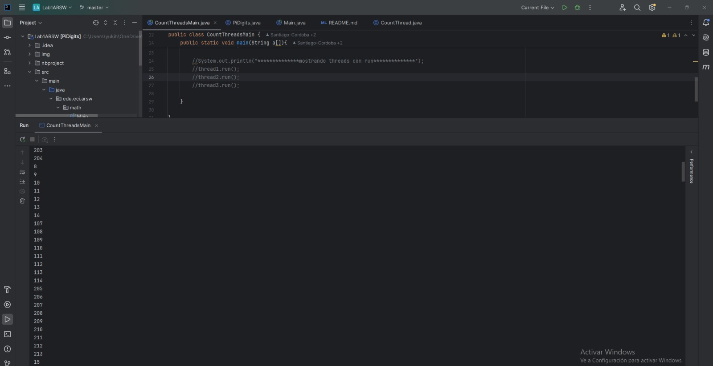

# Lab1ARSW

## Realizado por:
    Santiago Cordoba Dueñas
    Santiago Silva Roa 

## Parte 1 - Hilos

1. Implementacion CountThread 

Primero hacemos que la clase herede de Threads, luego definimos dos parametros, uno de inicio y otro de fin.
En la clase CountThread, recibe esos dos parametros y ejecuta el metodo run, que permite ejecutar en un hilo separado 
cuando se llame a start(). 

 ```yaml 
public class CountThread extends Thread {

    private final int a;
    private final int b;

    public CountThread(int a, int b) {
        this.a = a;
        this.b = b;
    }

    @Override
    public void run(){
        for(int i = a; i < b; i++){
            System.out.println(i);
        }
    }
}
 ```

2. Modificacion clase Main, para crear los 3 hilos asignando rangos distintos: 

Creamos los 3 hilos haciendo el llamado a CountThread y asignando los 3 rangos especificos 
    1. (0 a 99)
    2. (99 a 199)
    3. (200 a 299)

 ```yaml 
 
 public class CountThreadsMain {
    
    public static void main(String a[]){
        CountThread thread1 = new CountThread(0,99);
        CountThread thread2 = new CountThread(99,199);
        CountThread thread3 = new CountThread(200,299);

        System.out.println("***********mostrando threads con start**************");
        thread1.start();
        thread2.start();
        thread3.start();

        //System.out.println("**************mostrando threads con run**************");
        thread1.run();
        thread2.run();
        thread3.run();
        
    }
}
```

## Pruebas

Tres hilos con el metodo start: 





Tres hilos con el metodo run: 


### Cambie el incio con 'start()' por 'run()'. Cómo cambia la salida?, por qué?.

Cuando se usa el metodo start() se realiza una ejecucion de  los hilos en paralelo, lo que genera una salida desordenada, ya que los hilos corren al mismo tiempo. 

En cambio, al usar run(), los hilos se ejecutan secuencialmente, uno tras otro, sin paralelismo, produciendo una salida más ordenada.

## Parte 2 - Hilos Java

1. Para la realizacion de este punto, creamos la implementacion de ThreaderLab: 

Donde la clase posee tres atributos: 

    start: posición inicial donde se generarán los dígitos de π.
    count: cantidad de dígitos a calcular.
    result: un arreglo donde se almacenarán los dígitos generados.

Y, en el metodo run(): 
    Se llama a PiDigits.calculateDigits(start, count) para calcular los dígitos de π.
    Se copian los dígitos obtenidos en el arreglo result, comenzando en la posición start.


```yaml
public class ThreadLab extends Thread {
    private final int start;
    private final int count;
    private final byte[] result;

    public ThreadLab(int start, int count, byte[] result) {
        this.start = start;
        this.count = count;
        this.result = result;
    }

    @Override
    public void run() {
        byte[] digits = PiDigits.calculateDigits(start, count);
        System.arraycopy(digits, 0, result, start, count);
    }
}
```

2. Modificamos la clase getDigits en la clase PiDigits, permitiendo agregar un parametro que indique la cantidad de hilos que queremos que se use en una solucion. 

Despues, usamos el metodo Join, haciendo el bloqueo del hilo principal hasta que este termine su ejecucion. 

```yaml
public static byte[] getDigits(int start, int count, int numThreads) throws InterruptedException {
        if (start < 0 || count < 0) {
            throw new IllegalArgumentException("Invalid range");
        }

        byte[] digits = new byte[count];
        int digitsPerThread = count / numThreads;
        int remainder = count % numThreads;

        Thread[] threads = new Thread[numThreads];
        int currentStart = 0;

        for (int i = 0; i < numThreads; i++) {
            int threadCount = digitsPerThread + (i < remainder ? 1 : 0);
            threads[i] = new ThreadLab(start + currentStart, threadCount, digits);
            threads[i].start();
            currentStart += threadCount;
        }

        for (Thread thread : threads) {
            thread.join();
        }

        return digits;
    }
```

3. Modificamos la clase Main para permitir hallar el enesimo numero de pi con 1,2 y 3 hilos. 

```yaml
public static void main(String[] a) throws InterruptedException {
        System.out.println("Primeros 10 dígitos de PI con 1 hilo:");
        System.out.println(bytesToHex(PiDigits.getDigits(0, 10, 1)));

        System.out.println("Primeros 100 dígitos de PI con 2 hilos:");
        System.out.println(bytesToHex(PiDigits.getDigits(0, 100, 2)));

        System.out.println("Primeros 1,000,000 de dígitos de PI con 3 hilos:");
        System.out.println(bytesToHex(PiDigits.getDigits(0, 10000, 3)));
}
```

## Parte 3 - Evaluación de Desempeño

Realizamos un metodo necesario para hacer las pruebas solicitadas: 

```yaml
 private static void runExperiments() throws InterruptedException {
        int totalDigits = 1000; 
        int numCores = Runtime.getRuntime().availableProcessors();

        // Experimento 1: Con un solo hilo
        System.out.println("Ejecutando con 1 hilo...");
        long startTime = System.currentTimeMillis();
        PiDigits.getDigits(0, totalDigits, 1); 
        long endTime = System.currentTimeMillis();
        System.out.println("Tiempo con 1 hilo: " + (endTime - startTime) + " ms");

        // Experimento 2: Con tantos hilos como núcleos de CPU
        System.out.println("Ejecutando con " + numCores + " hilos...");
        startTime = System.currentTimeMillis();
        PiDigits.getDigits(0, totalDigits, numCores); 
        endTime = System.currentTimeMillis();
        System.out.println("Tiempo con " + numCores + " hilos: " + (endTime - startTime) + " ms");

        // Experimento 3: Con el doble de hilos que núcleos
        System.out.println("Ejecutando con " + (numCores * 2) + " hilos...");
        startTime = System.currentTimeMillis();
        PiDigits.getDigits(0, totalDigits, numCores * 2); 
        endTime = System.currentTimeMillis();
        System.out.println("Tiempo con " + (numCores * 2) + " hilos: " + (endTime - startTime) + " ms");

        // Experimento 4: Con 200 hilos
        System.out.println("Ejecutando con 200 hilos...");
        startTime = System.currentTimeMillis();
        PiDigits.getDigits(0, totalDigits, 200); 
        endTime = System.currentTimeMillis();
        System.out.println("Tiempo con 200 hilos: " + (endTime - startTime) + " ms");

        // Experimento 5: Con 500 hilos
        System.out.println("Ejecutando con 500 hilos...");
        startTime = System.currentTimeMillis();
        PiDigits.getDigits(0, totalDigits, 500); 
        endTime = System.currentTimeMillis();
        System.out.println("Tiempo con 500 hilos: " + (endTime - startTime) + " ms");
    }
```

Prueba 1: 

4 digitos: 

Resultados consola: 

Ejecutando con 32 hilos... 
Tiempo con 32 hilos: 101 ms 
Ejecutando con 200 hilos... 
Tiempo con 200 hilos: 107 ms 
Ejecutando con 500 hilos... 
Tiempo con 500 hilos: 150 ms


5 digitos: 

Ejecutando con 1 hilo... 
User program running 
Tiempo con 1 hilo: 17336 ms 
Ejecutando con 16 hilos... 
Tiempo con 16 hilos: 1791 ms 
Ejecutando con 32 hilos... 
Tiempo con 32 hilos: 1678 ms 
Ejecutando con 200 hilos... 
Tiempo con 200 hilos: 1598 ms 
Ejecutando con 500 hilos... 
Tiempo con 500 hilos: 1644 ms


6 Digitos

Aca comenzamos a realizar las pruebas con 6 digitos y los respectivos hilos.


al finalizar nos dio que se demoro un total de 26644539ms con un hilo


Con el maximo de hilo que estaban disponibles, es decir 12 hilos el tiempo total fue de 5552951 ms


Tomamos los datos que logramos sacar en una tabla y apartir de ahi haremos las suposiciones.


Para el proceso del cálculo con el doble de hilos, 200 y 500 no logramos desarrollarlos debido a que el computador no
fue capaz de poder desarrollar la tarea sin presentar problemas.(debido a eso la última imagen es una foto a la pantalla 
del pc)
3. Preguntas: 

1. *¿Por qué no funciona mejor con 500 hilos? ¿Cómo se compara con 200 hilos?*  
Con 500 hilos, el sistema se complica porque tiene que gestionar demasiados hilos a la vez, lo que hace que el rendimiento no mejore. Con 200 hilos, el tiempo es un poco mejor para 1000 dígitos y casi igual para 10000 dígitos. Esto muestra que usar más hilos no siempre es mejor.

2. *¿Qué pasa si usas tantos hilos como núcleos tiene tu computadora, comparado con el doble de hilos?*  
Si usamos tantos hilos como núcleos, el rendimiento es bueno porque cada núcleo trabaja eficientemente. Si usamos el doble de hilos, el sistema tiene que cambiar entre ellos constantemente, lo que no mejora mucho el rendimiento. Por ejemplo, con 16 y 32 hilos, la diferencia es pequeña.

3. *¿Sería mejor usar 1 hilo en 500 máquinas en lugar de 500 hilos en una sola computadora?*  
Sí, sería mejor. Si usaramos 1 hilo en cada una de 500 máquinas, cada máquina trabaja de forma independiente, evitando problemas de competencia por recursos. Esto mejora el rendimiento.

4. *¿Y si usas c hilos en 500/c máquinas?*  
También sería mejor. Distribuir los hilos entre varias máquinas ayuda a que cada una trabaje sin complicaciones, aprovechando mejor los recursos y evitando cuellos de botella.